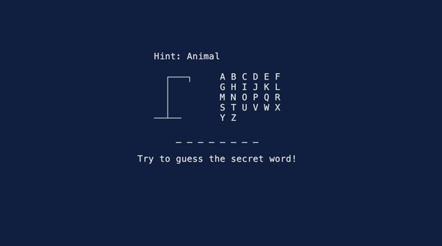

[](https://www.repostatus.org/#concept)
[](https://github.com/jwodder/hangman/actions/workflows/test.yml)
[](https://codecov.io/gh/jwodder/hangman)
[](https://www.rust-lang.org)
[](https://opensource.org/licenses/MIT)

This is a Rust program for playing a game of [Hangman][] in your terminal.

[Hangman]: https://en.wikipedia.org/wiki/Hangman_(game)



Usage
=====

    hangman [<options>]

Play Hangman.  By default, the secret word is chosen at random from a built-in
list, but it can also be chosen from a file you provide or set to a specific
value passed on the command line.

Play consists of entering one letter at a time in order to guess the secret
word.  If six incorrect guesses are made before the word is completely
uncovered, you lose (though you will get to see the full word as a
consolation).

You can quit the game early at any time by pressing Escape or Ctrl-C, though
you won't find out what the secret word was that way.

Currently, only ASCII letters can be guessed; if the secret word contains any
other kinds of characters, they will be revealed from the start of play rather
than having to be guessed.


Options
-------

- `-f <FILE>`, `--words-file <FILE>` — Select a word at random from the given
  file (or from standard input if `<FILE>` is `-`).  Each word in the file must
  be on a line of its own.  A word may optionally be given a hint by appending
  a comma and then the hint, e.g.:

    ```csv
    elephant,Animal
    carrot,Vegetable
    chalk,Mineral
    ```

- `-w <WORD>`, `--word <WORD>` — Use `<WORD>` as the secret word.  This is
  useful for testing or for setting up a game for an opponent to play.

- `-H <HINT>`, `--hint <HINT>` — Use `<HINT>` as the hint for a word specified
  with `--word`
